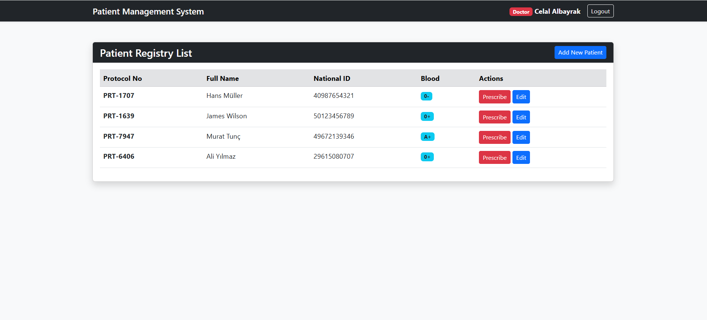
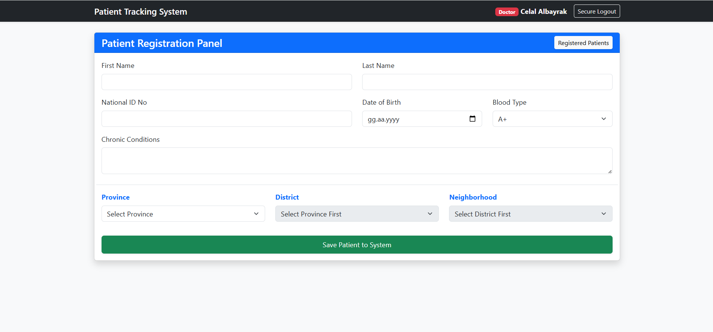
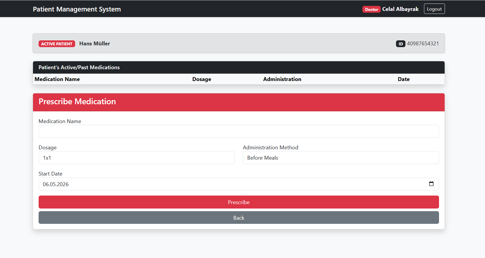
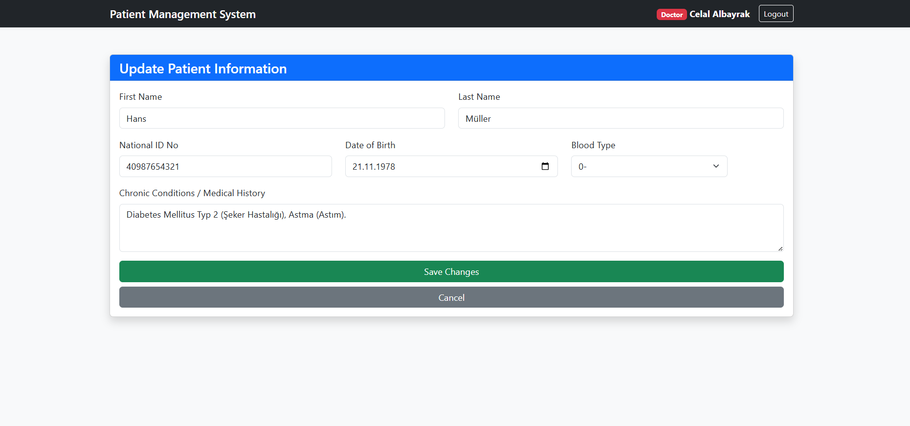

# SmartMed-Fullstack

# 🏥 MediStream: Advanced Patient Management System

MediStream is a high-performance, web-based healthcare management platform designed to digitize clinical operations. This project showcases my ability to build secure, scalable, and user-centric Full-Stack solutions tailored for the healthcare industry.

> **Note:** This repository is a visual showcase of the project's interface and capabilities. The source code is private.

## 🌟 Visual Tour & Core Modules

### 📋 Intelligent Patient Dashboard
The system features a streamlined dashboard where healthcare providers can track patients in real-time using unique protocol IDs.

*Key Insight: High-speed data fetching and intuitive UI for busy clinical environments.*

### 📝 Secure Registration & Demographic Tracking
A robust data entry module that handles complex patient information, including chronic condition history and location-based integration.

*Key Insight: Error-prevention logic and structured data storage.*

### 💊 Electronic Prescription (e-Prescribing)
The e-Prescription module ensures patient safety by allowing doctors to manage medication dosages and administration methods with a clear historical view.

*Key Insight: Designed to minimize clinical errors and improve patient outcomes.*

### ⚙️ Profile Management & Updates
Seamlessly update patient records and medical histories to ensure the most current data is always available at the point of care.

## 🛠️ Specialized Tech Stack
*   **Backend Engineering:** Developed with **PHP** using secure **PDO** structures to ensure data integrity and protection against SQL injection.
*   **Frontend Excellence:** Built with **JavaScript**, **HTML5**, and **CSS3** focusing on a clean, responsive, and distraction-free User Experience (UX).
*   **Database Architecture:** Optimized **MySQL** schema designed for healthcare data standards.

---
## 📩 Contact for Collaboration
If you are interested in the technical implementation, source code access, or potential collaborations, feel free to reach out.

**Developer:** Celal Albayrak  
**e-mail:** celalce25@hotmail.com                                  
**Focus:** IoT | Full-Stack Development | Health-Tech Solutions
